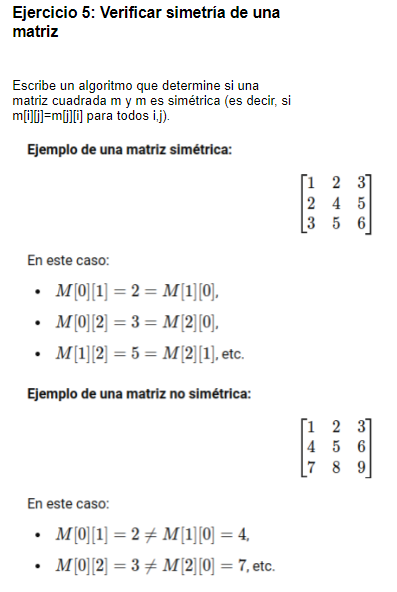

# 1. Formulación del problema

<p align="center">
  
</p>

# 2. Resolución

> I) Entrada del valor de la variable "dimension"

```bash
import java.util.Scanner;
```

```bash
    public static void main(String[] args) {
        Scanner sc = new Scanner(System.in);
        System.out.println("Ingresar dimension [d]: ");
        int d = sc.nextInt();
        
        if(d <= 0){
           d = sc.nextInt();;
        }
```

> II) Ingreso de numeros a la matriz cuadrada

```bash
    Verificar_Simetria(d);
```

```bash
public class Main {
    public static void Verificar_Simetria(int d){
    Scanner sc = new Scanner(System.in);
    int[][] Matriz = new int[d][d];
    int SiNo = 0;
    
    for(int i=0; i < d; i++){
        
        for(int j=0; j < d;j++){
            System.out.print("["+i+"]"+"[" + j+"]");
            Matriz[i][j] = sc.nextInt();           
        }
    }
```
> III) Comprobación de la existencia de la matriz simetrica, impresión de la matriz cuadratica y la verificación de la simetria como dato de salida

```bash
    for(int i=0; i < d;i++){
        for(int j=0; j < d;j++){
           System.out.print("["+Matriz[i][j]+"]");
           if(Matriz[j][i] == Matriz[i][j]){
           SiNo++;   
           }
        }
        System.out.println(""); 
    }
    if(SiNo == d*d){
    System.out.println("ES SIMETRICO");    
    }
    else{
    System.out.println("NO ES SIMETRICO");   
    }
    
    }
```

### Codigo completo
```bash
import java.util.Scanner;

public class Main {
    public static void Verificar_Simetria(int d){
    Scanner sc = new Scanner(System.in);
    int[][] Matriz = new int[d][d];
    int SiNo = 0;
    
    for(int i=0; i < d; i++){
        
        for(int j=0; j < d;j++){
            System.out.print("["+i+"]"+"[" + j+"]");
            Matriz[i][j] = sc.nextInt();           
        }
    }    
    
    for(int i=0; i < d;i++){
        for(int j=0; j < d;j++){
           System.out.print("["+Matriz[i][j]+"]");
           if(Matriz[j][i] == Matriz[i][j]){
           SiNo++;   
           }
        }
        System.out.println(""); 
    }
    if(SiNo == d*d){
    System.out.println("ES SIMETRICO");    
    }
    else{
    System.out.println("NO ES SIMETRICO");   
    }
    
    }

    public static void main(String[] args) {
        Scanner sc = new Scanner(System.in);
        System.out.println("Ingresar dimension [d]: ");
        int d = sc.nextInt();
        
        if(d <= 0){
           d = sc.nextInt();;
        }
        Verificar_Simetria(d);        
    }
}
```
